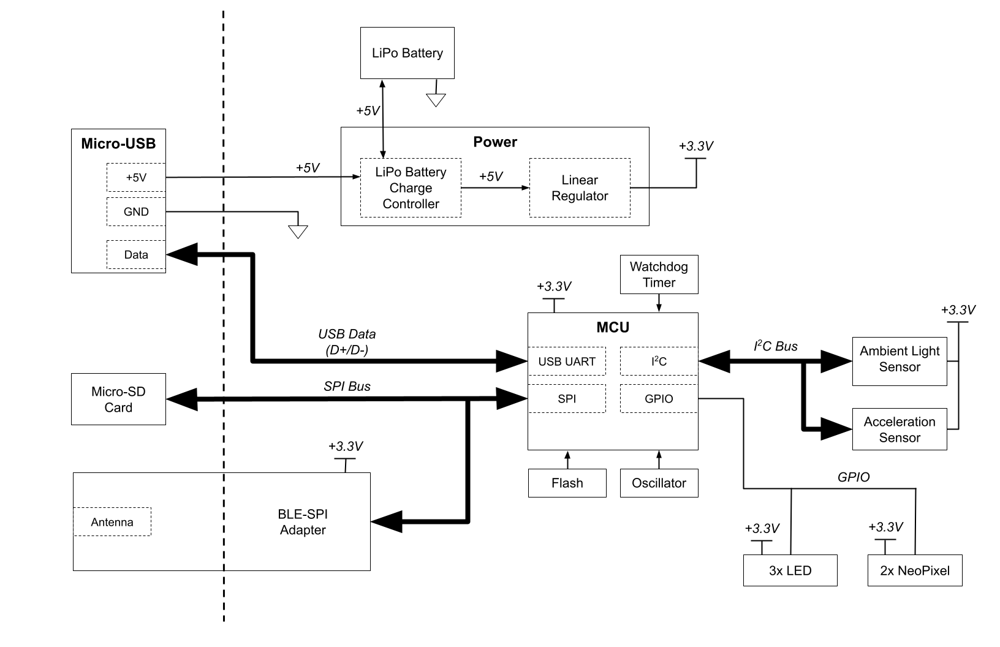

# EE 256 Final Project: Christmas Ornament

Board files and firmware for my final project for EE 256. I made a relatively
simple project - just a smart christmas ornament.

TODO: Add feature list

## Block Diagram

## Project Structure
  * `firmware`: code for the MCU
  * `host`: code to communicate with the MCU over Bluetooth LE
  * `kicad`: board files
  * `kicad-lib`: global library files referenced by the board files
